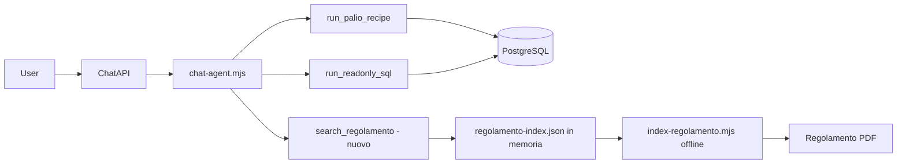

# Rifiniture chatbot Dimmelo + RAG Regolamento

## Contesto attuale

Il chatbot ([`be/server/chat-agent.mjs`](be/server/chat-agent.mjs)) è un agente **tool-calling su PostgreSQL**: il system prompt è breve (~20 righe) e non spiega la terminologia del Palio. I campi `estratta`, `ordine_assegnazione`, `orecchio`, `coscia`, `cavallo_preso_da` e la tabella `mangini` esistono nel DB ([`db/migrations/released/prerelease.sql`](db/migrations/released/prerelease.sql)) ma non compaiono nel prompt né nelle ricette.

Il PDF [`be/doc/Regolamento per il Palio.pdf`](be/doc/Regolamento%20per%20il%20Palio.pdf) (~2,8 MB) **non è referenziato da nessun codice**. Inserirlo intero nel prompt non è praticabile (~centinaia di migliaia di token per richiesta).



---

## Parte 1 — Glossario terminologico (prompt + ricette)

### 1.1 Nuovo modulo di conoscenza dominio

Creare [`be/server/chat-domain-knowledge.mjs`](be/server/chat-domain-knowledge.mjs) con due sezioni concatenate nel system prompt:

**Terminologia risposta** (regole che hai indicato):
- **Fantini**: preferire il soprannome; se serve forma estesa e sono disponibili entrambi: `{nome} detto {soprannome}`; se manca il soprannome, usare `nome`.
- **Mangini**: sinonimi accettati *fiduciari* / *tententi*; tabella `mangini` + join `palio_partecipazione_mangini(partecipazione_id, mangini_id, ordine)`.
- **canape**: posizione nei canapi per la mossa; **10 = Rincorsa**; se la contrada in rincorsa ha `non_partecipa=true`, la rincorsa **scala** (spiegarlo a parole, non ricalcolare in SQL).
- **ordine** + **estratta**: ordine di estrazione / *posto alle trifore*; `estratta=true` = estratta a sorte mentre le altre correvano di diritto.
- **ordine_assegnazione**: ordine sorteggio cavallo in tratta.
- **orecchio** (1–10): numero per l’assegnazione in tratta.
- **coscia** (1–N cavalli presentati): numero per le batterie di selezione; l’orecchio segue l’ordine delle coscie scelte (es. coscia 4→orecchio 1, 9→2, …).
- **cavallo_preso_da**: contradaiolo in **montura** (*si è monturato* / *vestito*); in linguaggio corrente *va a prendere il cavallo* / *ha portato il cavallo*.

**Schema esteso** (sostituisce il blocco `Schema sintetico` attuale):

```
palii(source_code, data_palio, straordinario)
contrade(name)
cavalli(nome)
fantini(nome, soprannome)
mangini(nome); palio_partecipazione_mangini(partecipazione_id, mangini_id, ordine)
palio_partecipazioni(
  palio_id, contrada_id, vincitrice, non_partecipa,
  canape, ordine, estratta, estratta_da_id,
  ordine_assegnazione, orecchio, coscia,
  cavallo_id, fantino_id, cavallo_preso_da, proprietario_cavallo,
  ordine_arrivo, capitano_id, priore_id, barbaresco_id
)
```

Aggiornare [`be/server/chat-agent.mjs`](be/server/chat-agent.mjs) per importare il modulo e comporre `SYSTEM_PROMPT`. Aggiungere istruzione: per domande sul **regolamento / regole ufficiali**, usare `search_regolamento` prima di rispondere; per dati storici, restano i tool SQL.

### 1.2 Espressione SQL condivisa per il fantino

In [`be/lib/palio-recipes.mjs`](be/lib/palio-recipes.mjs), estrarre un frammento riusabile:

```sql
CASE
  WHEN f.id IS NULL THEN NULL
  ELSE COALESCE(NULLIF(TRIM(f.soprannome), ''), NULLIF(TRIM(f.nome), ''))
END AS fantino
```

Usarlo in `last_win` e `palio_participants` (oggi solo `f.soprannome`). Opzionale: esporre anche `f.nome AS fantino_nome` per permettere al modello la forma estesa nel testo.

### 1.3 Ricetta `palio_participants`

Aggiungere colonne utili già in DB: `pp.estratta`, eventualmente join su `estratta_da_id` per il nome contrada estrattrice. Mantenere `ORDER BY pp.ordine NULLS LAST, pp.canape NULLS LAST`.

Nessuna nuova ricetta obbligatoria: il glossario + schema esteso bastano perché il modello scriva SQL mirato per mangini, tratta, orecchio/coscia.

---

## Parte 2 — RAG sul Regolamento (scelta: tool dedicato)

### Strategia token

| Approccio | Costo per richiesta | Quando usarlo |
|-----------|---------------------|---------------|
| PDF nel prompt | Altissimo | Non fattibile |
| Glossario fisso nel prompt | Basso (~1–2k token, cacheabile) | Terminologia + schema |
| **RAG tool** | Solo top-k chunk (~500–1500 token) | Domande sul regolamento |

Il PDF viene letto **una sola volta** dallo script di indicizzazione; a runtime il server carica un file JSON in memoria all’avvio.

### 2.1 Dipendenze

In [`be/package.json`](be/package.json):
- `pdf-parse` — estrazione testo dal PDF
- `@xenova/transformers` — embedding **locali** multilingua (nessuna API key aggiuntiva; modello ~small, es. `Xenova/multilingual-e5-small`)

Alternativa futura: provider cloud (Voyage/OpenAI) via config se la qualità locale non basta.

### 2.2 Script di indicizzazione offline

Nuovo [`be/tasks/index-regolamento.mjs`](be/tasks/index-regolamento.mjs):
1. Legge il PDF da `be/doc/Regolamento per il Palio.pdf`
2. Normalizza testo (spazi, hyphenation)
3. Chunking per paragrafi/sezioni (~400–600 caratteri, overlap ~80) con metadati `section` / `page` se ricavabili
4. Calcola embedding per ogni chunk
5. Scrive [`be/data/regolamento-index.json`](be/data/regolamento-index.json) (testo + vettore + metadati)

Aggiungere script npm: `"index-regolamento": "node tasks/index-regolamento.mjs"`.

Il file JSON va **versionato** (o generato in CI/build) così in produzione non serve ricalcolare gli embedding a ogni deploy.

### 2.3 Modulo di ricerca

Nuovo [`be/lib/regolamento-rag.mjs`](be/lib/regolamento-rag.mjs):
- `loadIndex()` — lazy load + cache in memoria al primo utilizzo
- `searchRegolamento(query, { topK: 5 })` — embed della query, cosine similarity, ritorna chunk con score e riferimento sezione/pagina
- Gestione errore chiara se l’indice manca (“eseguire `npm run index-regolamento`”)

### 2.4 Nuovo tool nel chatbot

In [`be/server/chat-agent.mjs`](be/server/chat-agent.mjs):

```js
search_regolamento: tool({
  description: 'Cerca nel Regolamento ufficiale del Palio. Usare per regole, procedimenti, definizioni ufficiali.',
  inputSchema: z.object({ query: z.string() }),
  execute: async ({ query }) => wrapToolResult(await searchRegolamento(query)),
})
```

Aggiornare la strategia nel system prompt (punto 0 o 4):
- Domande su **regole/regolamento** → `search_regolamento` (1 chiamata), poi rispondere citando il regolamento
- Dati storici → ricette/SQL come oggi
- Chiarire che il regolamento **integra** ma non sostituisce i dati DB

### 2.5 Config opzionale

In [`be/config/config.example.mjs`](be/config/config.example.mjs):

```js
regolamento: {
  indexPath: 'be/data/regolamento-index.json',
  topK: 5,
  minScore: 0.35,
},
```

### 2.6 Test

- [`be/test/regolamento-rag.test.js`](be/test/regolamento-rag.test.js): mock index piccolo (2–3 chunk), verifica ranking e formato output
- Aggiornare eventuali assert SQL in [`be/test/palio-recipes.test.js`](be/test/palio-recipes.test.js) se cambiano le SELECT

### 2.7 Documentazione operativa

Breve nota in [`README.md`](README.md) sezione Dimmelo:
- `npm run index-regolamento` dopo aggiornamento del PDF
- Il tool risponde su regolamento + dati DB

---

## Cosa non fare in questa iterazione

- **pgvector / migrazione DB** — overkill per un solo documento statico; JSON + memoria è sufficiente
- **Ricalcolo canape con scaling** — regola esplicativa nel prompt, non logica SQL
- **Inclusione integrale del PDF nel prompt** — esclusa per costo token

---

## Ordine di implementazione suggerito

1. `chat-domain-knowledge.mjs` + aggiornamento `SYSTEM_PROMPT`
2. Ricette fantino / `palio_participants`
3. Pipeline RAG (script index → `regolamento-rag.mjs` → tool)
4. Test + README + prima esecuzione `index-regolamento` per generare il JSON
